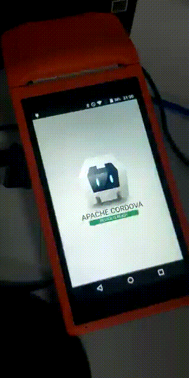

    

# cordova-plugin-sunmi-inner-printer
Cordova/Ionic Plugin for Sunmi V1 Printer

Tested with cordova-android >= 7.1.0

Plugin based on https://github.com/labibramadhan/cordova-sunmi-inner-printer

#### Changelog 2021-02-11

1. Automatically add `"com.sunmi:sunmiui:latest.release"` into gradle.

2. Replaced `canvas.save(Canvas.ALL_SAVE_FLAG)` with `canvas.save()` on `BitmapUtils.java`

3. Updated the `AIDL` with `version 2.1`

#### DOCS

in preparation